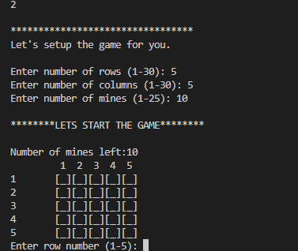

# Minesweeper
CLI Minesweeper in JAVA 

## Demo & Snippets
### Main Menu

### Stats

### Game Demo

## Project Description
The goal of this project is to create minesweeper game that is built in JAVA and runs through command line interface.

## Project Requirements
- A grid (10 by 10) containing 10 mines
- An object-oriented approach to build the game.
- User interacts with the game through command line.

## Tools Used:
JAVA

## Design:
The following is the hierarchy of classes used to implement the game:
- Minesweeper: This is the main controller class that runs the main loop and manages user interactions. Based on user's input it can display game statistics, start the actual game based on parameters set by user and exit the program.
  - Grid: Grid is the representation of the main game board. It contains a list of cells. It maintains state of the board and can make changes to it depending on the user input. The grid size is decided at runtime depending on user's input.
  - Cell: Each cell represents a cell in the game. It can have a value that represents the number of mines around that cell. It can be of type MINE if a cell contains a mine.
- CellType : It is an enum that contains cell types. (MINE, EMPTY or NEXT_TO_MINE);
- ActionChoice : It is an enum that contains response types/action choices from the user like SHOW_STATS, PLAY_GAME,MARK etc.
- ASCIIArt: It is a class that has methods to display a congratulations message and a blast in ASCII art.

## Implementation Details
### Main Menu
The Minesweeper class runs the main loop. A user can choose between displaying stats, playing game and quiting. 

### Stats
The game statistics are stored in a text file. Each time user plays a game the file is updated to reflect current statistics. FileReader and FileWriter classes are used to interact with the file. If a file does not exist a new file is created to maintain statistics.

### Game
#### Setup
The game is dynamically set up by the player. The player chooses number of rows (r), number of columns (c) and number of mines (m). The Minesweeper class initializes the grid based on user input. It sets up the grid with Cells. A unique list of m random integers between 0 and (r * c)
is generated. This list is converted into x and coordinates for mines and cells are marked as mines depending on these locations. After that, for each mine a list of surrounding cells is generated and the value of that surrounding cell that represents the number of mines in its vicinity is incremented. Java stream interface is used to filter these cells. The whole grid is initialised to be 'unrevealed'.

### Reaveal Cell
The player can either reveal or mark the cell. If the user chooses to reveal the cell, the boolean attribute isRevealed is set to true. If the revealed cell is a mine, game ends. If the value of a cell is 0, which means that the surrounding cells do not contain any mines, the surrounding cells are also revealed recursively until a mine or a cell with value more than 0 is encountered. The surrounding cells list id generated and filtered using JAVA stream interface.
### Mark Cell
The player has option to mark and unmark a cell as mine. A count is displayed to keep track of how many mines are left to be marked. The game ends when a user has marked all the mines correctly and revealed all other cells.

## Future Goals
- Integrate the game with a GUI

## Change logs

### 27/04/2024 - Basic game, grid and cells setup

### 28/04/2024 
- Added empty cell cascading
- Added game end detection
- Added score file manager

